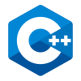

# SYDE-223-Labs Winter 2020
## Contributors: 
#### [Mary McPhee](https://github.com/maryrsmcphee)
#### [Sammy Robens-Paradise](https://github.com/SammyRobensParadise) 

## Description
This repository contains the code for the SYDE 223 Data Structure and Algorithms Course for the Winter 2020 semester.\


  \
<br>



## Structure
```
| SYDE-223-Labs
    | Lab1
    | Lab2
    | Lab3
    | PracticeExercise2
```
Each folder contains an independent build manifest called `CMakeLists.txt`. The build target is `~/cmake-build-debug`.
## Usage
1. Clone repo
```
git clone https://github.com/maryrsmcphee/SYDE-223-Labs.git
```
2. Change to desired lab or project directory
```bash
$ cd SYDE-223-Labs/${LAB_DIR}
```
3. Select build target. Recommended IDE is CLion Version > 2019. If you are having trouble building the project try reloading your IDE, or CLion.
4. Build Project, output to console.

<br></br>

# What's in this this repo
## Lab Assignment 1

### Topic: Use List ADT in Software Design

## Lab Assignment  2

### Topic: Linked List Data Structure and C++ Inheritance


## Lab Assignment 3

### Topic: Heap ADT and Binary Search Tree ADT Applications 

# For Informational use only